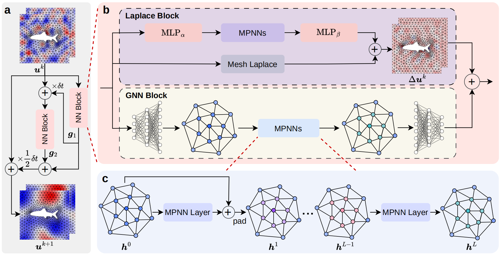

# PhyMPGN: Physics-encoded Message Passing Graph Network for spatiotemporal PDE systems

**Official PyTorch Implementation** | ICLR 2025 Spotlight Paper

**Authors**: Bocheng Zeng, Qi Wang, Mengtao Yan, Yang Liu, Ruizhi Chengze, Yi Zhang, Hongsheng Liu, Zidong Wang, Hao Sun.


[](https://arxiv.org/abs/2410.01337)

>**Abstract**: Solving partial differential equations (PDEs) serves as a cornerstone for modeling complex dynamical systems. Recent progresses have demonstrated grand benefits of data-driven neural-based models for predicting spatiotemporal dynamics (e.g., tremendous speedup gain compared with classical numerical methods). However, most existing neural models rely on rich training data, have limited extrapolation and generalization abilities, and suffer to produce precise or reliable physical prediction under intricate conditions (e.g., irregular mesh or geometry, complex boundary conditions, diverse PDE parameters, etc.). To this end, we propose a new graph learning approach, namely, Physics-encoded Message Passing Graph Network (PhyMPGN), to model spatiotemporal PDE systems on irregular meshes given small training datasets. Specifically, we incorporate a GNN into a numerical integrator to approximate the temporal marching of spatiotemporal dynamics for a given PDE system. Considering that many physical phenomena are governed by diffusion processes, we further design a learnable Laplace block, which encodes the discrete Laplace-Beltrami operator, to aid and guide the GNN learning in a physically feasible solution space. A boundary condition padding strategy is also designed to improve the model convergence and accuracy. Extensive experiments demonstrate that PhyMPGN is capable of accurately predicting various types of spatiotemporal dynamics on coarse unstructured meshes, consistently achieves the state-of-the-art results, and outperforms other baselines with considerable gains.


## ✨ Key Features



- ✅ Incorporates message-passing GNNs into numerical integrators to model spatiotemporal dynamics
- ✅ Learnable Laplace block encoding discrete Laplace-Beltrami operators for diffusion terms
- ✅ Padding strategy encoding different boundary condition types into the learning model
- ✅ Strong generalization and long-term prediction capabilities with limited training data


## ➡️ Implementation Ecosystem
| Framework | Repository |
|-----------|------------|
| PyTorch | Current |
| MindSpore | [Official Implementation](https://gitee.com/mindspore/mindscience/blob/r0.7/MindFlow/applications/data_mechanism_fusion/phympgn/README.md) |


## 📥 Installation

### Step 1. Clone the repository

```shell
git clone https://github.com/intell-sci-comput/PhyMPGN.git
cd PhyMPGN
```

### Step 2. Create an environment and install dependencies
```shell
conda create -n phympgn python=3.9
conda activate phympgn
pip install -r requirements
```

## 🚀 Usage
### Step 1. Download datasets
[The cylinder flow datasets](https://download-mindspore.osinfra.cn/mindscience/mindflow/dataset/applications/data_mechanism_fusion/PhyMPGN/).

### Step 2. Configure project setting
The `config/train.yaml` file serves as the configuration file for the project, including settings for dataset size, model parameters, and paths for logging and weight saving. Modify these settings according to your requirements.

### Step 3. Generate Training/Testing Data Cache
```shell
cd cylinder_flow
python generate_data.py --file configs/train.py
```

### Step 4. Train

#### Single GPU

If you want to train on a single GPU, you can execute:
```shell
python train.py --file configs/train.yaml &
tail -f <your setting log_file>  # watch log
```

#### Multi GPUs

The repository uses [Accelerate](https://huggingface.co/docs/accelerate/index) library for distributed training on multiples GPUs.

If you want to train on multiple GPUs, you need to configure Accelerate for how the current system is setup for training. To do so, you can modify `configs/accelerate.yaml` directly or run the script if you are familar with the library.

```shell
accelerate config --file configs/accelerate.yaml
```

Once your environment is setup, launch your training script with accelerate launch.
```shell
accelerate launch --config_file configs/accelerate.yaml train.py --file configs/train.yaml &
tail -f <your setting log_file> # watch log
```

### Step 5. Test
```shell
python test.py --file configs/test.yaml
```

## 📈 Citation

If you find this repository useful, please cite our paper:

```bibtex
@inproceedings{zeng2025phympgn,
  title={Phy{MPGN}: Physics-encoded Message Passing Graph Network for spatiotemporal {PDE} systems},
  author={Bocheng Zeng and Qi Wang and Mengtao Yan and Yang Liu and Ruizhi Chengze and Yi Zhang and Hongsheng Liu and Zidong Wang and Hao Sun},
  booktitle={The Thirteenth International Conference on Learning Representations},
  year={2025},
  url={https://openreview.net/forum?id=fU8H4lzkIm}
}
```

## 🤝 Acknowledgements

This work is supported by the National Natural Science Foundation of China and the Beijing Natural Science Foundation. We thank collaborators from **Renmin University of China** and **Huawei Technologies Ltd.**